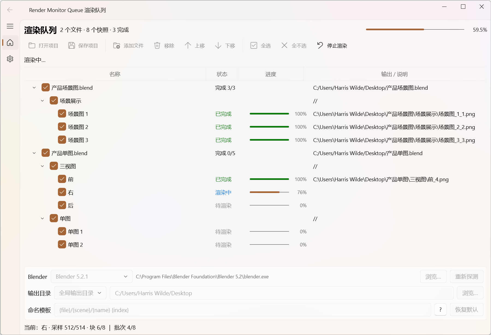

# Render Monitor Queue 渲染排队器

把 [Blender-Render-Monitor](https://github.com/HarrisWilde/Blender-Render-Monitor) 插件的
「场景快照批量渲染」提升为**独立桌面应用**：在 Blender 里用插件建好各场景快照（可跨多个
.blend、跨多个场景），把 .blend 文件**拖进本应用排队**，即可在后台 `blender -b` 子进程中
**严格串行**地逐个渲染——渲染期间应用不冻结，可随时停止；失败的快照保持「失败」状态，
重新勾选即可重试。

- 技术栈：**Python + PySide6 + PySide6-Fluent-Widgets**
- 平台：**Windows 先行**，代码保持三平台可移植（macOS/Linux 仅需补齐 Blender 路径探测与打包）
- 许可：**GPL-2.0-or-later**
  - 复用 `vendor/render_monitor/` 插件包（源自 Blender-Render-Monitor，同许可，见
    [LICENSE](LICENSE)）；应用自身代码同样采用 GPL-2.0-or-later。
- 前置依赖：本机安装 Blender 4.2+（应用启动时会自动探测，也可在「设置」中手动指定）

## 功能（v0.2.0 已实现）

- **拖入排队**：拖拽（或「添加文件」）一个或多个 `.blend` → 后台起 `blender -b` 探针，
  只读枚举文件内每个场景用插件建好的快照（UID/名称/插件状态），不修改文件；
- **三层队列**：文件 ▸ 场景 ▸ 快照 树形展示；文件可上/下移动排序、移除；
- **勾选渲染**：每个快照前勾选框，文件/场景级勾选可整组开关；「全选 / 全不选」；
- **命名模板**：`{file} {scene} {name} {index} {frame}`，`/` 生成子目录，默认
  `{file}/{scene}/{name} {index}`（所有段经清洗，防路径穿越/非法字符）；
- **串行渲染**：按文件分组、每文件只启动一次 Blender 并加载一次，其内多场景/多快照
  依次渲染后再换下一个文件；渲染到唯一临时文件、成功后**原子替换**（失败/取消保留旧输出）；
- **实时进度**：当前快照名 + 完成/失败计数（0.5s 轮询 mmap 共享进度，不产生渲染期磁盘 IO）；
- **停止/崩溃一致**：停止 → 当前张复位「待渲染」；进程崩溃/致命错误 → 按插件语义精确标记
  （渲染中→失败，早退→整批失败），不误报；
- **项目持久化**：队列（文件顺序/勾选/各快照结果/输出设置）保存为 `.rmq.json`，随时打开续跑；
- **失败重试**：失败项保持勾选与错误信息，修正后再次「开始渲染」即可（应用不预删任何旧输出）；
- **自动更新检查**：设置页可开关；应用启动后自动请求 GitHub Releases 检测新版本，发现新版会提示并可在设置页「前往下载」；支持手动「立即检查」。

## 版本历史

### v0.2.0

- 新增自动更新：设置页增加「更新」卡片，支持启动时自动检查与手动检查；
- 检测到新 Release 后可在设置页一键前往下载安装包；
- 重构/新增 `updater.py`、`UpdateCheckWorker`，后台检查不阻塞 UI。

### v0.1.1

- 修复 qfluentwidgets `ProgressBar` 残留动画会把已完成进度条异步拉回 0 的问题；
- 快照行内/顶部整体进度条高度调整为默认 4px；
- 同步更新主界面截图。

### v0.1.0

- 首个可用版本：拖入 .blend 枚举快照、三层队列、勾选批量渲染、实时进度、
  项目持久化、失败重试、PyInstaller/Inno Setup 打包。

## 截图/界面



启动后左侧导航：「队列」（渲染队列主页，含 Blender/输出目录/命名模板）与「设置」
（主题、自动更新、关于）。界面为 Fluent 风格；支持浅色/深色主题（跟随系统或手动切换）。

## 快速开始（开发）

```powershell
# 1) 准备环境（Python 3.10+）
python -m venv .venv
.\.venv\Scripts\python -m pip install -e ".[dev]"

# 2) 启动应用
.\.venv\Scripts\python -m rmqueue
#    或安装后的入口： rmqueue

# 3) 测试
.\.venv\Scripts\python -m pytest -q          # 纯逻辑 + UI 回归单测（62 个）
.\.venv\Scripts\python tests\ui_smoke.py     # UI offscreen smoke
.\.venv\Scripts\python tests\smoke_probe.py --all     # 真实 Blender 枚举 E2E
.\.venv\Scripts\python tests\render_e2e.py --all      # 真实 Blender 渲染 E2E
```

> 网络受限环境：`pip` 需走代理时设置 `HTTP_PROXY/HTTPS_PROXY` 环境变量（本机 Clash
> 等本地代理如 `http://127.0.0.1:7890`）或使用国内镜像源。

## 目录结构

```
src/rmqueue/
├── app.py               # 入口（QApplication + 主窗）
├── blender_tools.py     # Blender 安装探测/版本解析/选择（纯逻辑）
├── blender_probe.py     # blender -b 运行器 + 快照枚举探针脚本
├── naming.py            # 输出命名模板与安全清洗（纯逻辑）
├── queue.py             # 队列模型 + 项目 JSON + 探针合并（纯逻辑）
├── progress.py          # mmap 进度协议（应用/子进程双端共用）
├── render_session.py    # 渲染子进程编排 + 会话收尾状态修正
├── updater.py           # GitHub Release 自动更新检查（纯逻辑）
└── ui/
    ├── main_window.py   # Fluent 主窗（控制器：探针/渲染调度/更新检查/项目 IO）
    ├── queue_page.py    # 队列页（拖放/三层树/勾选/排序/进度）
    ├── settings_page.py # 设置页（主题/自动更新/关于）
    └── workers.py       # QThread：ProbeWorker / RenderWorker / UpdateCheckWorker
vendor/render_monitor/   # 复制的 GPL 插件包（子进程注入复用）
tests/                   # unittest/pytest + fixture/E2E/smoke 脚本
AGENTS.md                # 给 Agent 的仓库须知（上游同步为第一要项）
docs/upstream-sync.md    # 上游同步流程与当前漂移状态
```

## 上游同步（重要）

本项目的 `vendor/render_monitor/` 来自上游 Blender 插件
[Blender-Render-Monitor](https://github.com/HarrisWilde/Blender-Render-Monitor)，
不是本仓库独立维护的源码。**上游更新逻辑后，这边需要同步并核对应用侧适配。**

- 给 Agent/开发者的入口见 [AGENTS.md](AGENTS.md)；
- 同步流程、依赖契约与当前漂移状态见 [docs/upstream-sync.md](docs/upstream-sync.md)；
- 当前 vendor 代码版本为 v1.5.7，上游 master 已到 v1.5.8（尚未同步）。

## 架构要点

- **渲染 = 子进程，绝不阻塞 UI**：与插件一致，`blender -b <file> -P <内嵌脚本>`；主应用用
  QThread worker 驱动，0.5s 轮询一次；
- **进度交换 = 文件-backed mmap**：长度前缀 + JSON payload，单写单读无锁；协议唯一实现
  （`progress.py`）同时被注入脚本 import，杜绝两端漂移；
- **数据只读**：应用从不写回 .blend；快照以 UID 定位，源文件只作为渲染输入；
- **可测性**：模型/命名/协议/收尾状态机/更新检查均为纯 Python（pytest 62 个），真实
  Blender 流程由 fixture + E2E 覆盖（已在 Blender 5.0.0 与 4.5.3 LTS 上通过）。

## 打包（PyInstaller + Inno Setup）

```powershell
# 1) 先构建 onedir 应用
.\.venv\Scripts\python -m pip install pyinstaller
.\.venv\Scripts\python -m PyInstaller packaging\rmqueue.spec --noconfirm

# 2) 再用 Inno Setup 生成安装包
#    需要本机安装 Inno Setup 6，并把 ISCC.exe 所在目录加入 PATH
ISCC.exe packaging\installer.iss
```

产物：

- `dist\RenderMonitorQueue\`：onedir 免安装形态（含 `vendor\render_monitor` 与 `rmqueue` 包；
  `find_vendor_dir()`/`app_src_dir()` 已兼容 `_MEIPASS`）
- `dist\installer\RenderMonitorQueue-Setup-<版本>.exe`：Windows 安装包

换平台打包需在该平台执行，并确认 Blender 路径探测分支（mac/Linux 见 `blender_tools.py`）。

## 已知限制

- 快照需先在 Blender 中由 Render Monitor 插件创建（应用只读）；应用内不做捕获/写回；
- 渲染输出以「应用设置」的输出目录与命名模板为准（不复用 .blend 内场景的 rm_output_dir）；
- 帧号相关：模板含 `{frame}` 时以快照记录帧为准（「使用快照帧」恒开）；
- .blend 被移动后，其 `//` 相对引用资源可能失效（Blender 侧报错 → 该项失败并显示原因）；
- 只支持 Blender 4.2+（渲染脚本依赖插件扩展属性）。

## 路线图

- [x] 脚手架 / 依赖 / 纯逻辑层
- [x] Blender 路径探测
- [x] 队列模型 + 项目 JSON 持久化 + 探针合并
- [x] `blender -b` 探针与渲染引擎（含 mmap 进度/原子替换/状态修正）
- [x] 双 Blender 真实 E2E（枚举 + 渲染）
- [x] Fluent UI（队列页/设置页/worker 集成）
- [x] 自动更新检查（GitHub Release）
- [x] PyInstaller / Inno Setup Windows 安装包
- [ ] 端到端 GUI 手工验证 / 崩溃-恢复续跑打磨
- [ ] macOS、Linux 支持
